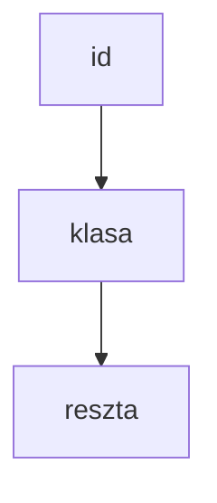

[[HTML]]
[[JavaScript]]
[[Python basic]]

---

# Section 5 CSS
#css

[[CSS box model]]


index.html
```html
<head>  
      <link rel="stylesheet" href="part1.css">  
</head>
```

```css
/* comments */*
selected tag{  
      property:value;  
}  

h1{  
      color:blue;  
}

```
in search engine: color picker =>
`color: rgb(22,22,22)    color: #0895a8`

```css
/* effect an all page  */
body{  
}  

body{  
	background:url([https://pixabay.com/photos/beach-sea-sunset-sun-sunlight-1751455](https://pixabay.com/photos/beach-sea-sunset-sun-sunlight-1751455 "https://pixabay.com/photos/beach-sea-sunset-sun-sunlight-1751455"));
```
---
`ids` to target single elements
`classes` to target groups of elements


```css
/*classes*/
.firstDiv{
	color:blue;
}

.secondDiv{
	color:red;
}

/*ids*/
#singledout{
	color:green;
	text-decoration: line-through;
}

/* first unorder list after the h3*/
h3 + ul{
	border: 4px dotted purple;
}

/* all links in li*/
li a{
	color:red;
}


```


---

## What type of tags overrule others
#css/specificity


---

## FONTs
#css/fonts

- size
- weight
- text alignment, ...
- download and change fonts


```css
h1{
	font-family: "Arial";
}

p{
	font-family: monospace;
}

/*
in the body you set a default value (1em)
*/
body{
	font-size: 20;
}

#two{
	font-size:1.5em;
}

p{
	font-style:italic;
	font-weight: bold;
}

h1{
	text-align: center;
}

/*
1em = 16px
2em = 32px
*/

```


### Which font on which OS
#### CSS Font Stack
https://www.cssfontstack.com


### Add fonts what you like
You can download fonts what you like and link them to your project.

LINKS:
- https://fonts.google.com
- https://fontlibrary.org


---


