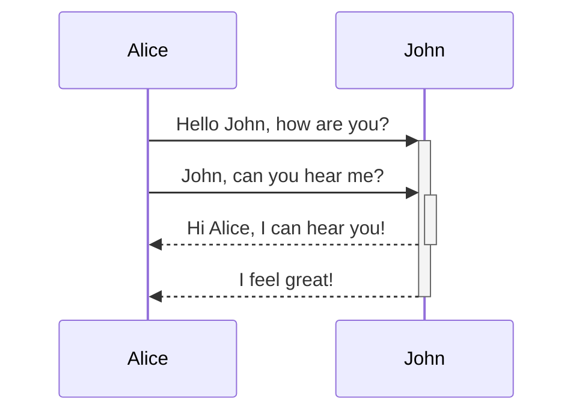
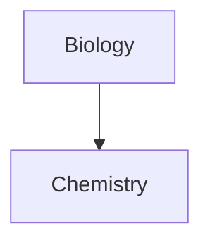

[[0 - How to - Help obsidian]]

# Format your notes - Markdown-based note taking

## LINKS

### Linki wewnętrzne
```markdown
link do innej notatki: 
 [[tytuł notatki]]
 [[wyrażenie wyświetlone w notatce | tytuł notatki]]


link do nagłówka w notatce:
			[[#nagłówek]]
		

```

### Linki zewnętrzne
```markdown

[wyrazenie](pełny adres internetowy)
[Obsidian](http://obsidian.md)

```
[Obsidian](http://obsidian.md)

## link to block
```
'block' a paragraph, a blockquote, a list item, ....

[[fileName^]] -> po znaku '^' wybierasz, do jakiego elemntu chcesz link, a Obisdian automatycznie wygederuje id tego elementu

```


***

## [[Embeds]]

---


## Headers, Nagłowki
```
# This is a heading 1 
## This is a heading 2 
### This is a heading3
#### This is a heading 4 
##### This is a heading 5
###### This is a heading 6
```

---

## Emphasis, Wyróżnienia tekstu
```
*This text will be italic*
_This text will be italic_

**This tekst will be bold**
__This tekst will be bold__

this text wil be ==highlight text==

~~this text will apear crossed out~~


```

---

## Lists
```
1. item
2. item
	1. item
	2. item
		1. item

- item
- item
	- item
	- item
		- item
		- item

```

---

## Obrazy z internetu
``


``


---

## Blockquotes
`> this will be a blockquotes`

> this is a blockquotes 
> o
> >sierotce Marysi i
> > siedmiu
> > >> krasnoludkach

^a68cc0


---

## Inline code
\` tu umieszczasz kod   \`
`to jest linia kodu`

---

## Code blocks
[Wspierane języki ](https://prismjs.com/#supported-languages)
\`\`\`
Tak rozpoczynasz
i kończysz blok kodu
\`\`\`

```py

To jest blok kodu Pythona

```

---

## Task list
```
- [x] już zrobione
- [ ] jeszcze nie zrobione
- [?] to też już zrobiłem


```
- [x] to już zrobiłem
- [ ] tego jeszcze nie zrobiłem
- [?] to już zrobiłem
- [ ] można kilkać, że już się coś robiło


---
## Tables Tabele


```
First Header | Second Header 
------------ | ------------ 
Content from cell 1 | Content from cell 2 
Content in the first column | Content in the second column


```

First Header | Second Header
------------ | ------------
Content from cell 1 | Content from cell 2 
Content in the first column | Content in the second column


==alignment==

```
| Syntax      | Description | Test Text     |
| :---        |    :----:   |          ---: |
| Header      | Title       | Here's this   |
| Paragraph   | Text        | And more      |
```

| Syntax      | Description | Test Text     |
| :---        |    :----:   |          ---: |
| Header      | Title <br>new      | Here's this   |
| Paragraph   | Text        | And more      |


==table generator==
`https://www.tablesgenerator.com/markdown_tables`
[generator](https://www.tablesgenerator.com/markdown_tables)


==W tabeli można używać znaczników HTML.==

```
| Syntax      | Description |
| ----------- | ----------- |
| Header      | Title |
| Paragraph   | First paragragh. <br><br> Second paragraph. |
```

| Syntax      | Description |
| ----------- | ----------- |
| Header      | Title |
| Paragraph   | First paragragh. <br><br> Second paragraph. |

```
| Syntax      | Description |
| ----------- | ----------- |
| Header      | Title |
| List        | Here's a list! <ul><li>Item one.</li><li>Item two.</li></ul> |
```

| Syntax      | Description |
| ----------- | ----------- |
| Header      | Title |
| List        | Here's a list! <ul><li>Item one.</li><li>Item two.</li></ul> |

Dodatkowe formatowanie:
`https://www.markdownguide.org/hacks/#lists-within-table-cells`

(Formatowanie tabeli)(https://www.markdownguide.org/hacks/#lists-within-table-cells)


---
Horizontal Bar
`***  `
`---`
`___`

___

## Wyrażenia matemtayczne
```
$$
pomiędzy tymi znakami umieszczasz matematyczne napisy 
formatowane w KATEX

$$

```
`$$\begin{vmatrix}a & b\\ c & d \end{vmatrix}=ad-bc$$`
$$\begin{vmatrix}a & b\\ c & d \end{vmatrix}=ad-bc$$

Więcej:
więcej symboli: https://en.wikibooks.org/wiki/LaTeX/Mathematics
KATEX: https://katex.org/

___
Comments
To będą
\%\%
komentarze
\%\%
a teraz już nie


---
## Diagram
note: [[Mermaid basis]]


Mermaid: https://mermaid-js.github.io/mermaid/#/
[Mermaid Editor](https://mermaid-js.github.io/mermaid-live-editor/edit#pako:eNpVkE1qw0AMha8itEohvoAXhcZOsgmk0Ow8WQiPnBmS-WEsU4Ltu3ccU2i1kt77nhAasQ2ascRbomjgUisPuT6ayiTbi6P-CkXxPh1ZwAXPzwl2m2OA3oQYrb-9rfxugaAaTwvGIMb6-7xa1St_9jxB3ZwoSojXv87lO0ywb-ynyev_OyZxTh2ajsqOipYSVJReCG7RcXJkdT59XBSFYtixwjK3mjsaHqJQ-TmjQ9QkvNdWQsJS0sBbpEHC19O3v_PK1JbyI9wqzj8k-lxH)








---

## Comments

```markdown
%%
THis is a comment
%%
```

