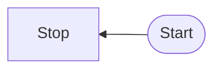

# Mermaid 


### Flowchart - schemat blokowy
#### orientations:
TB - top to bottom
BT - bottom to top
RL - right to left
LR - left to right

```
mermaid
flowchart TB
	Start --> Stop

```





---

#### nodes


```
flowchart LR  
 id1([This is the text in the box])`


flowchart LR  
 id1([[This is the text in the box]])`

flowchart TD  
 id1[/This is the text in the box/]

flowchart TD  
 A[/Christmas\]

```

---

#### Links


```
flowchart LR  
 a --> b & c--> d

flowchart LR  
 A-->B

flowchart LR  
 A --- B
 
flowchart LR  
 A-- This is the text! ---B


flowchart LR  
 A---|This is the text|B

flowchart LR  
 A-- text -->B

flowchart LR;  
 A-.->B;

flowchart LR  
 A o--o B  
 B <--> C  
 C x--x D

```
---
### PIE


```
mermaid
pie 
title Pets
 "Dogs" : 386
 "Cats" : 85
 "Rats" : 15

```


