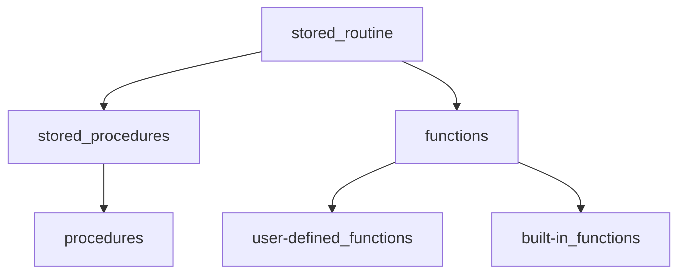

[[_Wprowadzenie SQL]]

---

# SQL Stored Routines
#sql/stored_routines

[[Procedure MySQL]]
[[User-Defined Functions in MySQL]]

---

> __routine__ (_in a context other than computer science_)
 a usual, fixed action, or series of actions, repeated periodically
 

>__stored routine__
>an SQL statement, or set of SQL statements, that can be stored on the database server

Whenever a user needs to run the query in question, they can _call_ , _reference_, or _invoke_ the routine

---

[[Procedure MySQL|Procedury]]
[[User-Defined Functions in MySQL]]

---

stored procedure | user-defined function
--- | ---
doesn't return   a value | returns a value
`CALL` procedure | `SELECT` function
multiple `OUT`   parameters | can return a single   value only
`insert update`  `delete` | --

- if you need to obtain more than one value as a result of calculation, you are better off using a procedure
- if you need just one value to be returned, then you can use a function

