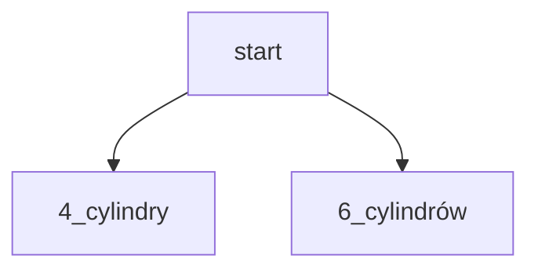

[[_Intro pradwdopodobieństwo]]

---

# Permutacje

## donicznki
kwiaty: różna, tuplipan, stokrotka, goździk   4
doniczki: czerwona, zielona, niebieska         3

liczba kombinacji: $3*4=12$

---

## obliczanie prawdopodobieństwa metodą drzewka

silnik: 4 cylindrowy, 6 cylindrowy
kolor: czerwony, niebieski, czarny, biały

Jakie jest prawdopodobieństwo otrzymania samochodu z 6 cylindrami w białym kolorze

